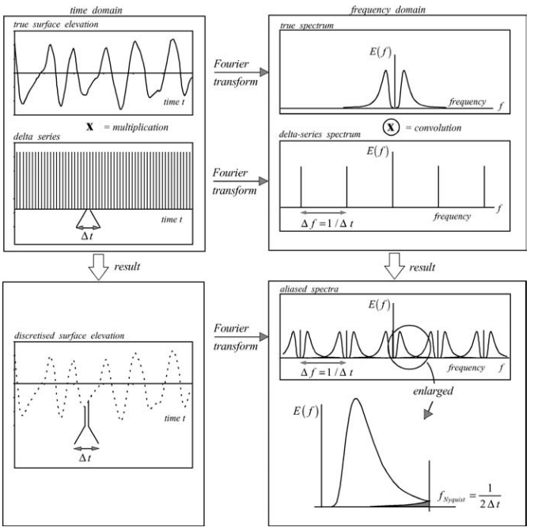

--- 
site: bookdown::bookdown_site

title: |
  <center>Notes of Waves in Oceanic and Coastal Waters book by Holthuijsen    2007</center>

  

author: "Esteban Meneses"
date: "`r Sys.Date()`"

header-includes:
    - \usepackage[english]{babel}
    - \usepackage[fleqn]{amsmath}
    - \usepackage{aligned}
    - \usepackage{amsmath}
    - \usepackage{color}
    - \usepackage{caption}
    - \usepackage[document]{ragged2e}
    - \usepackage{lipsum}
    - \usepackage{chngcntr}
    - \usepackage{hyperref}
    - \usepackage{mathtools}
    - \newtagform{noparen}{}{}
    - \usetagform{noparen}
    - \pagestyle{empty}
    - \usepackage[capitalise,nameinlink,noabbrev]{cleveref}
    - \creflabelformat{equation}{#2#1#3}
    - \usepackage{graphicx}
    - \graphicspath{ {docs/} }
    - \documentclass[fleqn]{article}
    - \captionsetup{skip=2pt,labelsep=space,justification=justified,singlelinecheck=off}
    
---


# Description of ocean Waves (Ch-3)

## **Wave height**

```{r wave,fig.align="center", echo=FALSE, fig.cap = "The definition of a ‘wave’ in a time record of the surface elevation with downward zero-crossings (upper panel) or upward zero-crossings (lower panel)"}

```

Sometimes a quadratically weighted averaged value is used to define the rootmean-square wave height Hrms:

```{=tex}
\begin{equation}
  H_{rms} = (\frac{1}{N} \sum_{i=1}^{N})^{1/2} 
(\#eq:1)  
\end{equation}
```
Such a measure of wave heights may be relevant for energy-related projects because the wave energy is proportional to the square of the wave height.

One of the concepts of the significant wave height is (Hs) the mean of the highest one-third of waves in the wave record[^1].

[^1]: If you are interested in history: this definition seems to have been introduced by Sverdrup and Munk (1946).

```{=tex}
\begin{equation}
Hs = H_{1/3} = \frac{1}{N/3} \sum_{j=1}^{N/3} H_j
(\#eq:2)  
\end{equation}
```
When j is the rank number of wave height (i.e., j=1 is the first highest wave, j=2 is the second highest and so on).

Sometimes it is consider the mean of the highest one-tenth:

```{=tex}
\begin{equation}
H_{1/10} = \frac{1}{N/10} \sum_{j=1}^{N/10} H_j
(\#eq:3)  
\end{equation}
```
```{r, include=FALSE,echo=FALSE}
Hs <- rnorm(1000, 2)
mean(sort(Hs, decreasing = T)[1:3])
```

## **Wave Period**

It is equally natural to define the period T of a wave as the time interval between the start and the end of the wave (see Fig. \@ref(fig:wave)).

In analogy with the significant wave height, the significant wave period Ts is defined as the mean period of the highest one-third of waves, T1/3.

```{=tex}
\begin{equation}
T_{1/3} = \frac{1}{N/3} \sum_{j=1}^{N/3} T_{0,j}
(\#eq:4)
\end{equation}
```
where, again, j is not the sequence number but the rank number of the wave, based on wave height (it is the same j as in the definition of the significant wave height, Eq. \@ref(eq:4)).

## **Visual observations and instrumental measurements**

There are three alternatives (apart from starting a dedicated measurement campaign): **visual observations, satellite measurements and computer simulations.**

```{r relation,fig.align="center", echo=FALSE, fig.cap = "The relationship between the visually estimated significant wave height and period and the measured significant wave height and period (after Nordenstrøm, 1969). The standard deviation of the measured values is about 15% of the mean of the measurements at every value of Hv or Tv"}
knitr::include_graphics("docs/fig3_3_relationships_waves_book.png")
```

The agreement between the visually estimated significant wave height (Hv) and the measured significant wave height (H1/3) is reasonable. In contrast to this, the visually estimated significant wave period does not agree well with the instrumental measurement, so that H1/3 ≈ Hv. And, this $T_{1/3} \neq Tv$ (see Fig. \@ref(fig:relation)).

## **Wave Spectrum**

The aim of describing ocean waves with a spectrum is not so much to describe in detail one observation of the sea surface (i.e., one time record), but rather to describe the sea surface as a stochastic process, i.e., to characterise all possible observations (time records).

Here, we base this treatment on the random-phase/amplitude model, which leads to the wave spectrum, which is the most important form in which ocean waves are described.

To distinguish the essence from these additional aspects, consider first a wave record, i.e., the surface elevation η(t) at one location as a function of time, with duration D, obtained at sea with a wave buoy or a wave pole (see Fig. \@ref(fig:elevation)).

We can exactly reproduce that record as the sum of a large number of harmonic wave components (a Fourier series):

```{=tex}
\begin{equation}
\eta(t)=\sum_{i=1}^{N} a_{i}cos(2 \pi f_{i} t + \alpha_{i})
(\#eq:5)  
\end{equation}
```
where $a_{i}$ and $\alpha_{i}$ are the amplitude and phase, respectively,5 of each frequency $f_{i}$= i/D (i = 1, 2, 3, . . .; the frequency interval is therefore $\Delta f$ = 1/D). With a Fourier analysis, we can determine the values of the amplitude and phase for each frequency and this would give us the amplitude and phase spectrum for this record (see Fig. \@ref(fig:elevation)).

```{r elevation,fig.align="center", echo=FALSE, fig.cap = "The observed surface elevation and its amplitude and phase spectrum."}

```

If we were to repeat the experiment, i.e., measure the surface elevation again under statistically identical conditions (e.g., in an exact copy of the storm in which the first observation was made), the time record would be different and so would be the amplitude spectrum. To remove this sample character of the spectrum, we should repeat the experiment many times (M) and take the average over all these experiments, to find the average amplitude spectrum:

```{=tex}
\begin{equation}
\overline{a}_{i}= \frac{1}{m}\sum_{m=1}^{M} a_{i,m} \text{ for all frequencies } f_{i}
(\#eq:6)  
\end{equation}
```
where $a_{i,m}$ is the value of $a_{i}$ in the experiment with sequence number m. For large values of M the value of $a_{i}$ converges (approaches a constant value as we increase M), thus solving the sampling problem. However, it is more meaningful to distribute the variance of each wave component $\frac{1}{2}\overline{a}_{2}$ (see Note 3A). There are two reasons for this. First, the variance is a more relevant (statistical) quantity than the amplitude. Second, the linear theory for surface gravity waves (see Chapter 5) shows that the energy of the waves is proportional to the variance.

The variance spectrum $\frac{1}{2}\overline{a_{i}^{2}}$ is discrete, i.e., only the frequencies $f_{i}= i/D$ are present, whereas in fact all frequencies are present at sea. A first step to resolve this problem would be to distribute the variance $\frac{1}{2}\overline{a_{i}^{2}}$ over the frequency interval $\Delta f_{i}= i/D$, giving a variance density $\frac{1}{2}\overline{a_{i}^{2}}/\Delta f$ at each frequency (i.e., it is constant within the frequency band $\Delta f$ ). All frequencies would thus be represented because they have all been assigned a variance density.

This is resolved by letting the frequency interval $\Delta f$ approach zero ($\Delta f \to 0$). The definition of the variance density spectrum thus becomes

```{=tex}
\begin{equation}
E(f)= \displaystyle \lim_{\Delta f \to 0}  \frac{1}{\Delta f}\frac{1}{2}\overline{a^{2}} \text{ or } E(f)= \displaystyle \lim_{\Delta f \to 0}  \frac{1}{\Delta f} E\{\frac{1}{2}\underline{a^{2}}\}
(\#eq:7)  
\end{equation}
```
(in the formal definition, to be treated below, the average $\frac{1}{2}\overline{a^{2}}$ will be replaced with the expected value $E\{\frac{1}{2}\underline{a^{2}}\}$ and the frequency band need not be the same for all frequencies). The underscore of a indicates that the amplitude will be treated as a random variable.

### **The random-phase/amplitude model**

The basic model for describing the moving surface elevation η(t) is the randomphase/amplitude model, in which the surface elevation is considered to be the sum of a large number of harmonic waves, each with a constant amplitude and a phase randomly chosen for each realisation of the time record.

```{=tex}
\begin{equation}
\underline{\eta}(t)=\sum_{i=1}^{N} \underline{a}_{i}cos(2 \pi f_{i} t + \underline{\alpha}_{i})
(\#eq:8)  
\end{equation}
```
where N is a large number (of frequencies) and the underscores of amplitude a i and phase α i indicate that these are now random variables (see Fig. \@ref(fig:harmonic)). The phases and amplitudes, being random variables, are fully characterised with their respective probability density functions. In this model, the phase at each frequency $f_{i}$ is uniformly distributed between 0 and 2π (see Fig. \@ref(fig:random-phase-amplitude-model)):

```{=tex}
\begin{equation}
p(\alpha_{i}) = \frac{1}{2\pi} \text{  for } 0 < \alpha_{i} \le 2\pi
(\#eq:9)  
\end{equation}
```
```{r harmonic,fig.align="center", echo=FALSE, fig.cap = "The summation of many harmonic waves, with constant but randomly chosen amplitudes and phases, creates a random sea surface."}
knitr::include_graphics("docs/fig3_5_harmonics_waves_book.png")
```

and the amplitude a i is at each frequency Rayleigh distributed (with only one parameter µi varying over the frequencies; see Fig.\@ref(fig:random-phase-amplitude-model)):[^2]

[^2]: The harmonic component may also be written as η(t) = Ai cos(2π fit) + Bi sin(2π fit). In the randomphase/amplitude model, Ai and Bi would each be Gaussian distributed (with the same mean and standard.

```{=tex}
\begin{equation}
p(a_{i}) = \frac{\pi}{2} \frac{a_{i}}{\mu_{i}^{2}} \text{ exp}(-\frac{\pi a_{i}^{2}}{4\mu_{i}^{2}}) \text{ for } a_{i} \ge 0
(\#eq:10)  
\end{equation}
```
where µi is the expected value of the amplitude µi = $E\{\underline{a}_{i}\}$.

Since $\mu_{i}$ = $E\{a_{i}\}$ is the only parameter in Eq. (3.5.6), the statistical characteristics of a i are completely given by this one parameter (per frequency). The function that shows this mean amplitude along the frequency axis is called the amplitude spectrum $E\{\underline{a}_{i}\}$ (see Fig.\@ref(fig:random-phase-amplitude-model)).

For a given amplitude spectrum, a realisation of $\underline{\eta}(t)$ can be created with Eq. \@ref(eq:8) by drawing sample values of the amplitudes $a_{i}$ and phases $\alpha_{i}$ from their respective probability density functions, at each frequency separately and independently.

```{r random-phase-amplitude-model,fig.align="center", echo=FALSE, fig.cap = "The random-phase/amplitude model: at every frequency there is one uniform distribution for the random phase and one Rayleigh distribution for the random amplitude (characterised by the expected value $\\ E(a_{i})$). Top panels: for a series of frequencies, $\\ fi, i = 1, 2, 3, 4, 5$ etc. Bottom panel: the expected value of the amplitude as a function of frequency, i.e., the amplitude spectrum."}

```

Regarding the applicability of **the random-phase/amplitude model** to real ocean waves, the following remarks should be made.

-   First, the random-phase/amplitude model generates a stationary (Gaussian) process. To use this approach for conditions at sea, which are never really stationary, a wave record needs to be divided into segments that are each deemed to be approximately stationary (a duration of 15--30 min is commonly used for wave records obtained at sea. In addition, at sea the wave components are not really independent from one another because they interact to some degree. However, if the waves are not too steep and not in very shallow water, these interactions are weak and they can be ignored, leaving the random-phase/amplitude model in place as the basic model to describe ocean waves.

-   Second, the random-phase/amplitude model is a summation of wave components at discrete frequencies fi, whereas, in fact, a continuum of frequencies is present at sea.

### **The variance density spectrum**

The amplitude spectrum provides enough information to describe the sea-surface elevation realistically as a stationary, Gaussian process. However, it is more relevant to present the information in this spectrum in a different way: consider the variance $E\{\frac{1}{2} \underline{a}^{2}_{i}\}$ rather than the above-introduced expectation of the amplitude $E\{a_{i}\}$. In other words, consider the variance spectrum instead of the amplitude spectrum (see Fig. \@ref(fig:variance-density-spectrum) and Note 3A). Both the amplitude and the variance spectrum are based on discrete frequencies, whereas Nature does not select such discrete frequencies. All frequencies are present at sea. The random-phase/amplitude model needs therefore to be modified. This is done by distributing the variance $E\{\frac{1}{2} \underline{a}^{2}_{i}\}$ over the frequency interval $\Delta f_{i}$ frequency $f_{i}$. The resulting variance density spectrum $E∗( f_{i})$ is then$^{10}$

```{=tex}
\begin{equation}
E∗( f_{i})= \frac{1}{\Delta f_{i}} E \{\frac{1}{2} \underline{a}^{2}_{i}\} \text{ for all } f_{i}
(\#eq:11)  
\end{equation}
```
and $\Delta f_{i}$ is the interval between the frequencies. This spectrum is defined for all frequencies, but it still varies discontinuously from one frequency band to the next (see Fig. \@ref(fig:variance-density-spectrum)). A continuous version is obtained by having the width of the frequency band $\Delta f_{i}$ approach zero (see Fig. \@ref(fig:variance-density-spectrum)):

```{=tex}
\begin{equation}
E( f_{i})= \displaystyle \lim_{\Delta f \to 0} \frac{1}{\Delta f} E \{\frac{1}{2} \underline{a}^{2}\}
(\#eq:12)  
\end{equation}
```
```{=html}
<p style="border:3px; 
border-style:solid; 
border-color: black;
padding: 1em;

">
```
**This function** $E(f)$ is called the variance density spectrum. It is the single most important concept in this book..

</p>

The variance density spectrum gives a complete description of the surface elevation of ocean waves in a statistical sense, provided that the surface elevation can be seen as a stationary, Gaussian process. This implies that all statistical characteristics of the wave field can be expressed in terms of this spectrum (this is shown in Section 3.5.5).

```{r variance-density-spectrum, fig.align="center", echo=FALSE, fig.cap = "The transformation of the discrete amplitude spectrum of the randomphase/amplitude model to the continuous variance density spectrum."}

```

The dimension and S.I. unit of the variance density E(f) follow directly from its definition (Eq. 3.5.8): the dimension of the amplitude a is [length] and its S.I. unit is [m]; the dimension of the frequency band $\Delta f$ is $[time]^{−1}$ and its S.I. unit is [s−1], or rather [Hz]. The dimension of E(f) is therefore $[length^{2} /(1/time)]$ and its unit is either $m^{2} s \text{ or } m^{2}/H_{z}$ (personally, I prefer the unit $[H_{z}]$, because it shows better that frequencies are involved, rather than some time interval).

```{=html}
<p style="border:3px; 
border-style:solid; 
border-color: black;
padding: 1em;


">
```
**NOTE 3A The variance of the sea-surface elevation**\
The variance of the surface elevation $\eta(t)$ is, by definition, the average of the squared surface elevation (relative to its mean) $\underline{\overline{η}}^{2}$(the overbar indicates timeaveraging). For a harmonic wave with amplitude a, the variance is $\overline{\eta}^{2} = \frac{1}{2} a^{2}$. In the random-phase/amplitude model for *random* ocean waves, a large number of harmonic waves is added and the variance of this sum, i.e., the *random* surface elevation $\eta(t)$, is equal to the sum of the individual variances ('*the variance of the sum is the sum of the variances*'): $$variance = \underline{\overline{η}}^{2} = E\{\eta^{2}\} = \sum_{i=1}^{N} E\{\frac{1}{2}\ \underline{a}^{2}_{i}\} \text{ for } E\{\underline{\eta}\} = 0$$ The square root of this variance is the standard deviation ση of the surface elevation, which can be seen as a vertical scale of the wave heights. For instance, the significant wave height $H_{s} ≈ 4ση$ (see Section 4.2.2).

</p>

### **Interpretation of the variance density spectrum**

The variance density spectrum was introduced in the previous section by transforming the discrete amplitude spectrum into a continuous distribution of the variance over frequencies. This spectrum shows how much $\Delta var$ a frequency band $\Delta f$ contributes to the total variance (see Fig. \@ref(fig:interpretation-variance-density-spectrum)):


\begin{equation}
\boxed{\Delta var = \int_{\Delta f} E(f)df}
(\#eq:13)  
 
\end{equation}


It follows that the total variance $\underline{\overline{η}}^{2}$ (see Note 3A) of the sea-surface elevation is the sum of the variances of all frequency bands $\Delta f$ , or, for a continuous spectrum,[^3]

[^3]: Another way of finding the unit of E( f ) is to note that the S.I. unit of the total variance of the sea-surface elevation is m2 . Since the unit along the horizontal axis in Fig. \@ref(fig:interpretation-variance-density-spectrum) (frequency f ) is [Hz], it follows that the unit along the vertical axis (variance density E( f )) should be m2/Hz to arrive at unit m2 for the integral.

\begin{equation}
\text{total variance} = \underline{\overline{\eta}}^{2} = \int_{0}^{\infty} E(f)df
(\#eq:14)  
\end{equation}


```{r interpretation-variance-density-spectrum, fig.align="center", echo=FALSE, fig.cap = "The interpretation of the variance density spectrum as the distribution of the total variance of the sea-surface elevation over frequencies."}

```

Note that, in a random wave field, the contribution of a single frequency to the total variance is infinitely small, because the spectral bandwidth of a single frequency is zero: $\Delta f → 0$ and its contribution $\Delta var = E(f)\Delta f → 0$. However, the spectrum of one harmonic wave, i.e., a wave with only one frequency, contains a finite energy. Its spectrum therefore consists of a delta function at that frequency (infinitely narrow and infinitely high, with an integral equal to the variance of the harmonic wave, see Fig. \@ref(fig:harmonic-waves)).

**The variance density spectrum E(f), showing how the variance of the sea-surface elevation is distributed over the frequencies, is rather difficult to conceive: a statistical characteristic (variance) is distributed over the frequencies of the harmonic components that make up the process.** ***It may help if we multiply the spectrum by ρg. We then obtain the energy density spectrum (see below). This spectrum shows how the wave energy is distributed over the frequencies, which seems to be easier to comprehend.***

The overall appearance of the waves can be inferred from the shape of the spectrum: the narrower the spectrum, the more regular the waves are. This is shown for three different wave conditions in Fig. \@ref(fig:harmonic-waves).

Distributing the variance over a slightly wider frequency band gives a slowly modulating harmonic wave because the components involved differ only slightly in frequencies and therefore get out of phase with one another only slowly, thus creating a fairly regular wave field. Distributing the wave variance over a wider frequency band gives a rather chaotic wave field (irregular waves), because the components in the time record get out of phase with one another rather quickly.

```{r harmonic-waves, fig.align="center", echo=FALSE, fig.cap = "The (ir)regular character of the waves for three different widths of the spectrum."}
knitr::include_graphics("docs/fig3_9 irregular character of waves_waves_book.png")
```

As indicated above, the energy of the waves can be expressed in terms of the variance of the surface elevation because the energy of a harmonic wave (per unit horizontal ocean surface area) is equal to the mean-square elevation times the gravitational acceleration g and the density of water ρ, 5), so the total energy is

```{=tex}
\begin{equation}
E_{total}(f) = \rho g \underline{\overline{\eta}}^{2}
(\#eq:15)  
\end{equation}
```
We can therefore multiply the variance density spectrum $E_{variance}(f) = E( f )$ by ρg and obtain the energy density spectrum as

```{=tex}
\begin{equation}
E_{energy}(f) = \rho g E_{variance}(f)
(\#eq:16)  
\end{equation}
```
This close relationship leads to a rather inaccurate use of the word '*spectrum*'. It refers to both the variance density spectrum and the energy density spectrum. Very often, the two terms are used indiscriminately, with the context indicating which of the two is actually meant. Just as the variance density spectrum is used to describe the statistical aspects of the waves, so can the energy density spectrum be used to describe the physical aspects of waves (within the limitations of the stationary, Gaussian model and the linear theory of surface gravity waves).

### **Alternative definitions**

The variance density spectrum can be defined in other ways than the one given above. The differences may relate to (a) the spectral domain or (b) the formal definition.

<center>

**The spectral domain**

</center>

The variance density has been defined in Section 3.5.4 above in terms of frequency f = 1/T (where T is the period of the harmonic wave), but it can equally well be formulated in terms of radian frequency ω = 2π/T . The corresponding spectrum E(ω) is then defined in the same manner as E(f); the only difference being that cos(2π ft + α) is replaced with cos(ωt + α). The total variance $\underline{\overline{η}}^{2}$ should be conserved in such transformations. In other words,

\begin{equation}
\underline{\overline{\eta}}^{2} = \int_{0}^{\infty} E(w)dw = \int_{0}^{\infty} E(f)df
(\#eq:17)  
\end{equation}

which is readily achieved by taking

\begin{equation}
E(w)dw = E(f)df
(\#eq:18)  
\end{equation}

or

\begin{equation}
E(w) = E(f)\frac{df}{dw} = E(f)J
(\#eq:19)  
\end{equation}

where J = df/dω is called the Jacobian[^4]. In this case, that of transforming E(f) into E(ω), it has the value J = 1/(2π). **Therefore, one must not only transform the frequencies f into ω, but also transform the density E( f ) into the density E(ω).**

[^4]: More generally, transforming one (density) function F(x) into another F(y), where y is a function of x, i.e., y = f (x), under the condition that the integral is conserved, can be achieved with F(x) = F(y)J , in which J = dy/dx is the (one-dimensional) Jacobian. This applies to all density functions of which the integral needs to be conserved in the transformation (i.e., not only spectra but also probability density functions). The transformation of a two-dimensional density function requires a two-dimensional Jacobian: F(x1, x2) = F(y1, y2) J , where the Jacobian J is the determinant of the matrix ∂y1 ∂x1 ∂y2 ∂x1 ∂y1 ∂x2 ∂y2 ∂x2 which is $J = \frac{∂y1}{∂x1} \frac{∂y2}{∂x2} − \frac{∂y2}{∂x1} \frac{∂y1}{∂x2}$

<center>

**Formal definition**

</center>

The variance density spectrum has been defined above in terms of the randomphase/amplitude model. An alternative definition of the spectrum, which has exactly the same interpretation in the sense that it shows **the distribution of the total variance over the frequencies, is based on the Fourier transform of the auto-covariance function of the sea-surface elevation:**

\begin{equation}
\widetilde E (f) = \int_{- \infty}^{\infty} C(\tau) cos(2 \pi f \tau)d\tau \text{ for } -\infty \le f \le \infty
(\#eq:20)  
\end{equation}

where the auto-covariance function C(τ ) is defined as the average product of the elevations at moments t and t + τ (each relative to its mean; see Appendix A). For a stationary process, the value of t is not relevant (by definition all statistical characteristics are then constant in time) and the auto-covariance function depends only on the time difference τ :


\begin{equation}
C(\tau) = E\{\underline{\eta}(t)\underline{\eta}(t+ \tau)\} \text{ for } E\{\underline{\eta}(t)\} = 0
(\#eq:21)  
\end{equation}

For a stationary wave condition, both E˜ ( f ) and C(τ ) are even functions, i.e., E˜(− f ) = E˜( f ) and C(−τ ) = C(τ ). The variance density spectrum E( f ) is then defined as

\begin{equation}
E(f) = 2\widetilde E(f) \text{ for } f \ge 0
(\#eq:22)  
\end{equation}

Since C(τ ) contains all covariances of the joint probability density functions of η(t) and η(t + τ ) for any t and τ , it provides a complete description of the process in a statistical sense (if the process is stationary and Gaussian and its mean is zero).

It has been noted in Section 3.5.3 (without proof) that the variance density spectrum, too, provides such a complete description. This statement is based on the fact that the Fourier transform is reversible, so that, from Eq. (3.5.16): C(τ ) = ∞ −∞ E˜( f ) cos(2π f τ )df . This reversibility implies that the one function can be expressed in terms of the other without loss of information. The variance density spectrum therefore contains the same information as the auto-covariance function and it describes a stationary, Gaussian process as completely as the auto-covariance function does. It also follows that the total variance is η2 = C(0) = ∞ −∞E˜( f )df = ∞ 0 E( f )df , which indicates that the spectrum E( f ) gives the distribution of the total variance over the frequencies.

This definition of the variance density spectrum, which is based on the auto-covariance function, is not used very often because the corresponding computations (first, of the auto-covariance function and then of its Fourier transform) are rather inefficient compared with the calculation of the amplitudes of Eq. (3.5.8) directly from a wave record (with a technique called the Fast Fourier Transform, FFT; see Appendix C).

### **The frequency--direction spectrum**

To describe the actual, three-dimensional, moving waves, the horizontal dimension has to be added. To that end we expand the random-phase/amplitude model by considering a harmonic wave that propagates in x,y-space, in direction θ relative to the positive x-axis (we use ω instead of f for the sake of brevity in the notation):

\begin{equation}
\eta(x,y,t) = a cos(wt - kx cos \theta - ky sin \theta + \alpha) 
(\#eq:23)  
\end{equation}

or

\begin{equation}
\eta(x,y,t) = a cos(wt - k_{x}x - k_{y}y sin + \alpha) 
(\#eq:24)  
\end{equation}

**where the wave number k = 2π/L (where L is the wave length of the harmonic wave), kx = k cos θ, ky = k sin θ and θ is the direction of wave propagation**. Analogously to the one-dimensional model, the corresponding three(!)-dimensional random-phase/amplitude model (in x, y and t-space) is the sum of a large number of such propagating harmonic waves (see Fig. \@ref(fig:layers)):

```{r layers, fig.align="center", echo=FALSE, fig.cap = "The random waves moving in time, i.e., the sum of a large number of harmonic wave components, travelling across the ocean surface with different periods, directions, amplitudes and phases (after Pierson et al., 1955)."}

```

\begin{equation}
\underline{\eta}(x,y,t) = \sum_{i=1}^{N} \sum_{j=1}^{M} \underline{a}_{i,j} cos(w_{i}t - k_{i}x cos \theta_{j} - k_{i}y sin \theta_{j} + \underline{\alpha}_{i,j}) 
(\#eq:25)  
\end{equation}

Adding two dimensions to the original one-dimensional random-phase/ amplitude model (dimensions x and y, added to time t, or, equivalently, wave number k and direction θ, added to frequency ω) would result in two more indices in the summation of Eq. (3.5.20). However, the index for wave number k is equal to the index for frequency ω because frequency and wave number are uniquely related (through the dispersion relationship of the linear theory for surface gravity waves; see Chapter 5: ω2 = gk tanh(kd), where d is the water depth). Every wave number k thus corresponds to one frequency ω and vice versa. The seemingly three-dimensional random-phase/amplitude model therefore reduces to a two-dimensional model in terms of frequency (or wave number) and direction. Each wave component is therefore indicated in Eq. (3.5.20) with only two indices: i (for the frequency or wave number) and j (for the direction). As in the one-dimensional model, every individual wave component in this two-dimensional model has a random amplitude a i,j (Rayleigh distributed) and a random phase α i,j (uniformly distributed). This two-dimensional random-phase/amplitude model represents a Gaussian process that is stationary in time and homogeneous in x, y-space: a spatial pattern of chaotically moving surface elevations, seen as the sum of many wave components propagating with various amplitudes, phases and frequencies (or wave lengths) in various directions across the ocean surface. The effect is a realistic representation of random, short-crested waves (see Fig. 3.10).

By using the same techniques as before, the discrete two-dimensional amplitude spectrum can be transformed into a continuous two-dimensional variance density spectrum so that, for all i and j (see Fig. 3.11),

\begin{equation}
E(\omega, \theta) = \displaystyle \lim_{\Delta \omega \to 0} \lim_{\Delta \theta \to 0} \frac{1}{\Delta \omega \Delta \theta} E\{\frac{1}{2}\underline{a}^{2}\}
(\#eq:26)  
\end{equation}

or, in terms of frequency f,

\begin{equation}
\boxed{E(f, \theta) = \displaystyle \lim_{\Delta f \to 0} \lim_{\Delta \theta \to 0} \frac{1}{\Delta f \Delta \theta} E\{\frac{1}{2}\underline{a}^{2}\}}
(\#eq:27)  
\end{equation}


Obviously (using the proper Jacobian; see Section 3.5.5),

\begin{equation}
E(\omega, \theta) = \frac{1}{2 \pi}E(f, \theta)
(\#eq:28)  
\end{equation}


The dimension and S.I. unit of E( f, θ) follow directly from its definition[^5]: the dimension of the amplitude a is [length] and its S.I. unit is [m]. The dimension of

[^5]: Phillips (1977) defines a frequency--direction spectrum 0( f, θ) as 0( f, θ) = E( f, θ)/ f . This is unusual and confusing and Phillips (1985) carefully points out the difference between 0( f, θ) and E( f, θ).

```{r two-dims, fig.align="center", echo=FALSE, fig.cap = "The two-dimensional spectrum of wind-generated waves (shown in polar co-ordinates)."}

```


the frequency band $\Delta f$ is $[time]^{−1}$ and its S.I. unit is $[s^{−1}]$ or [Hz]. The direction band $\Delta θ$ is dimensionless but its units are either radians or degrees. The dimension of $E(f,θ)$ is therefore (from Eq. 3.5.22) $[length^{2} /(1/time)]$ and its unit is $[m^{2}/Hz/radian]$ or $[m^{2}/Hz/degree]$. The two-dimensional spectrum E(f,θ) shows how the variance of $η(x,y,t)$ is distributed over frequencies and directions just as the one-dimensional frequency spectrum shows how the variance is distributed over frequencies. The volume of $E(f,θ)$ is therefore equal to the total variance $\overline{\underline{η}}^{2}$ of the sea-surface elevation:

\begin{equation}
\overline{\underline{η}}^{2} = \int_{0}^{\infty} \int_{0}^{2 \pi}E(f, \theta)d\theta df
(\#eq:29)  
\end{equation}

The contribution of a spectral bin $(\Delta f, \Delta θ)$ to the total variance is (see Fig. \@ref(fig:contribution) and also Eq. \@ref(eq:13))

\begin{equation}
\Delta var = \int_{\Delta f} \int_{\Delta \theta}E(f, \theta)d\theta df
(\#eq:30)  
\end{equation}

```{r contribution, fig.align="center", echo=FALSE, fig.cap = "The contribution $\\Delta var$ of a spectral bin $(\\Delta f, \\Delta \\theta)$ to the total variance of the waves."}

```

The one-dimensional frequency spectrum E(f), which does not contain any directional information, can be obtained from the frequency-direction spectrum $E(f,θ)$ by removing all directional information by integration over all directions (per frequency):

\begin{equation}
\boxed{E(f) = \int_{0}^{2 \pi} E(f, \theta)d \theta}
(\#eq:31)  
\end{equation}

### **The spectrum at sea**


Suppose that a storm in the Norwegian Sea generates swell travelling south into the North Sea (see Fig. \@ref(fig:norwegian)). That swell will arrive one or two days later off the Dutch coast, where it may meet a young sea state being generated by a local breeze from westerly directions. The spectrum off the Dutch coast will then represent two wave systems: swell from the north and young wind sea from the west. Swell is generally of a much lower frequency than a young wind sea, so in this case the two wave systems are well separated, both in frequency and in direction. Moreover, swell is rather regular and long-crested, so its spectrum is narrow

In contrast to this, a young wind sea is irregular and short-crested and its spectrum is therefore much broader. The spectrum off the Dutch coast will therefore be rather distinctive in this situation: a narrow, low-frequency spectrum oriented in southerly directions (the direction of propagation) representing the swell and a much broader spectrum at higher frequencies oriented towards easterly directions, representing the locally generated wind sea.


```{r norwegian, fig.align="center", echo=FALSE, fig.cap = "An interpretation of the wave spectrum off the Dutch coast when a northerly swell, generated by a storm off the Norwegian coast, meets a locally generated westerly wind sea."}

```

### **Wave-number spectra**

In the previous sections, the surface elevation was considered as a spatial, moving surface, i.e., as a function of space and time: η(x, y, t). It can also be considered as a function of space alone, i.e., at one moment in time (a ‘frozen’ surface).
The moving, spatial, sea surface η(x, y, t) can also be described without assuming that the dispersion relationship of the linear wave theory is valid (as was done above). The description then requires a three-dimensional frequency–wave-number spectrum.

<center>
<i>The one-dimensional wave-number spectrum</i>
</center>
<br>
The rationale of the definition of the one-dimensional wave-number spectrum is identical to that of the one-dimensional frequency spectrum except that time t is replaced with the horizontal co-ordinate x and that radian frequency ω is correspondingly replaced with wave number k. **The one-dimensional variance density spectrum in terms of wave number, E(k), is then defined as**

\begin{equation}
E(k) = \displaystyle \lim_{\Delta k \to 0} \frac{1}{\Delta k} E\{\frac{1}{2}\underline{a}^{2}\}
(\#eq:32)  
\end{equation}

where $\Delta k$ is the wave-number bandwidth. Since frequencies $ω$ and wave numbers $k$ are related through the dispersion relationship of the linear theory for surface gravity waves, the wave-number spectrum can be obtained from the frequency spectrum with

\begin{equation}
E(k) = E(\omega) \frac{d \omega}{d k}
(\#eq:33)  
\end{equation}

where dω/dk is the Jacobian needed to transform from radian frequency to wavenumber domain (see Section 3.5.5; note that the value of this Jacobian happens to be equal to the velocity at which a group of waves propagates, cg = dω/dk; see Section 5.4.3), so that

\begin{equation}
E(k) = C_{g} E(\omega)
(\#eq:34)  
\end{equation}

All characteristics of this one-dimensional wave-number spectrum are identical or analogous to those of the frequency spectrum, e.g., **the total wave variance is given by**

\begin{equation}
\overline{\underline{η}}^{2} = \int_{0}^{\infty} E(k)dk
(\#eq:35)  
\end{equation}

<center>
<i>The two-dimensional wave-number spectrum</i>
</center>
<br>

The harmonic wave components underlying the spectral description of the frozen sea surface, in two spatial dimensions x and y, can be written as

\begin{equation}
\eta(x,y) = a_{i,j}cos(k_{x,i}x + K_{y,j}y + \alpha_{i,j})
(\#eq:36)  
\end{equation}

and the corresponding two-dimensional wave-number spectrum E(kx , ky ) is defined,^[The spectrum E(kx , ky ) may also be written as E(k ) = E(kx , ky ), where k = (kx , ky ) is called the wave-number vector.] analogously to the above definitions of the various spectra, as

\begin{equation}
E(k_{x},k_{y}) = \displaystyle \lim_{\Delta k_{x} \to 0} \lim_{\Delta k_{y} \to 0} \frac{1}{\Delta k_{x} \Delta k_{y}}  E\{\frac{1}{2}\underline{a}^{2}\}
(\#eq:37)  
\end{equation}

where $\Delta k_{x} \text{ and } \Delta k_{y}$ are the spectral bandwidths. Obviously, $k_{x} = k cos θ and k_{y} = k sin θ, where k = \sqrt{k^{2}_{x} + k^{2}_{y}} \text{ and } θ = arctan(k_{y}/k_{x}$ ), so that an equivalent two-dimensional spectrum can be defined as

\begin{equation}
E(k, \theta) = \displaystyle \lim_{\Delta k \to 0} \lim_{\Delta \theta \to 0} \frac{1}{\Delta k \Delta \theta}  E\{\frac{1}{2}\underline{a}^{2}\}
(\#eq:38)  
\end{equation}

where $\Delta k$ and $\Delta θ$ are the spectral bandwidths. The two spectra are related by

\begin{equation}
E(k, \theta) = E(k_{x}, k_{y})J
(\#eq:39)  
\end{equation}

where J = k is the Jacobian used to transform the spectrum from the two-dimensional $\vec k$-domain to the two-dimensional k, θ-domain (see footnote in Section 3.5.5). The two-dimensional frequency–direction spectrum E(ω, θ) is obtained from E(k, θ), simply with

\begin{equation}
E(\omega, \theta) = E(k, \theta)J
(\#eq:40)  
\end{equation}

where the Jacobian is J = dk/dω = 1/cg (see above). Similarly, we can find with c = ω/k that

\begin{equation}
E(k_{x}, k_{y}) = \frac{CC_{g}}{\omega} E(\omega, \theta)
(\#eq:41)  
\end{equation}

The one-dimensional wave-number spectrum is obtained from E(k, θ) by integrating over all directions:

\begin{equation}
E(k) = \int_{0}^{2 \pi} E(k, \theta)d\theta
(\#eq:42)  
\end{equation}

<br>
<center>
<b><i>The three-dimensional frequency–wave-number spectrum</i></b>
</center>
<br>


In the previous sections, it was assumed that the dispersion relationship of the linear wave theory provides a unique relationship between the frequency ω and the wave number k. The spectra can thus be transformed from wave-number space to frequency space (and vice versa) and it allows the use of a two-dimensional rather than a three-dimensional spectrum to represent the moving, three-dimensional surface of ocean waves η(x, y, t). If the dispersion relationship is not assumed a priori (for instance to verify this relationship with observations), then these transformations cannot be made. The random sea surface should then be seen as the sum of a large number of propagating harmonic waves for which the frequencies and wave numbers are independent:

\begin{equation}
\underline{\eta}(x,y,t) = \sum_{i=1}^{N} \sum_{j=1}^{M}  \sum_{j=1}^{P} \underline{a}_{i,j,l} cos(w_{i}t - k_{j}x cos \theta_{l} - k_{j}y sin \theta_{l} + \underline{\alpha}_{i,j,l}) 
(\#eq:43)  
\end{equation}

There are now three indices in this summation: the frequencies in this model have an index i that is different from the index of the wave number j. By using the same techniques as before, the three-dimensional variance density spectrum can now be defined as

\begin{equation}
E(\omega, k, \theta) = \displaystyle \lim_{\Delta \omega \to 0} \lim_{\Delta k \to 0} \lim_{\Delta \theta \to 0}  \frac{1}{\Delta \omega \Delta k \Delta \theta}  E\{\frac{1}{2}\underline{a}^{2}\}
(\#eq:44)  
\end{equation}

**The alternative frequency–wave-number vector spectrum E(ω, kx , ky ) = E(ω, k ) can be transformed to this three-dimensional spectrum E(ω, k, θ) with the proper Jacobian (see above)** because the relationship between wave-number k and direction θ on the one hand and wave-number vector k = (kx , ky ) on the other is retained (see Eq. 3.5.34). The definition of this spectrum E(ω, kx , ky ) is based on the same model as used to define E(ω, k, θ), with k j cos θl and k j sin θl replaced with kx,j and ky,l.

### **Spectrum acquisition**

The techniques used to acquire the one- ortwo-dimensional spectrum are essentially the following:

- measure the sea-surface elevation with in situ or remote-sensing techniques and analyse the records (see Appendix C), or
- predict the spectrum with numerical wave models using wind, tide and seabedtopography information.


The three-dimensional spectrum is hardly ever acquired since it would involve measuring the sea surface as a three-dimensional, moving surface (but it is sometimes done e.g., with a stereo- or radar-film. Operational spectral wave models always assume linear waves and predict the two-dimensional spectrum (usually E( f, θ)).In-situ measurements (e.g., with a heave buoy), followed by an appropriate spectral analysis can provide reasonable estimates of the one-dimensional frequency spectrum E ( f ) or E(ω). The mean direction and the directional spreading per frequency can also be determined if additionally some spatial characteristics of the waves are measured (e.g., with a pitch-and-roll buoy; see Section 6.3.4 for the concept of directional spreading). Remote-sensing and numerical wave models can estimate the full two-dimensional spectrum, usually the wave-number spectrum E(kx , ky ) (remote sensing) or E( f, θ) (wave models), from which the one-dimensional frequency spectrum E( f ) can readily be obtained.


## **Transfer functions and response spectra**


In Section (3.5.5), we considered the transformation of a wave spectrum from frequency f -space to the radian-frequency ω-space. This involved the simultaneous transformation of f to ω and of E( f ) to E(ω), using a Jacobian.

It is also possible to transform the spectrum of the surface elevation to the spectrum of some other wave variable, for instance, the wave-induced pressure in some point below the water surface. Such a transformation is not carried out with a Jacobian but with a transfer function. It requires that the relationship between the two variables can be treated as a linear system. The word ‘linear’ is crucial here. It means the following: consider a system that,

- on excitation with input x(t), responds with output X(t): x(t) → X(t) and 
- on excitation with input y(t), responds with output Y(t): y(t) → Y(t)

then the system is called linear, if a linear combination of these excitations gives the corresponding linear combination of the responses:

\begin{equation}
\boxed{ax(t) + by(t) \rightarrow aX(t) + bY(y)}
(\#eq:45)  
\end{equation}

It shows that an amplification of the excitation gives an equal amplification of the response. It also shows that the responses to the excitations are independent: the response to excitation x(t) is not affected by the response to excitation y(t) and vice versa. The linear theory for surface gravity waves provides such a linear system. For instance, in this theory, the relationship between a sinusoidal wave surface elevation – the excitation x(t) – and the corresponding sinusoidal water pressure at some point in the water – the response X(t) – is a simple linear relationship in the above sense: if the amplitude of the wave is doubled, then the resulting pressure is doubled, independently of other excitations. One characteristic of a time-constant, linear system is that, when the excitation is harmonic, with a given frequency, the response too is harmonic, with the same frequency:^[In the random-phase/amplitude model, I used the cosine representation for the harmonic wave. Here and in many other places in the book I use the sine representation. This illustrates nicely that it is often immaterial whether the sine or cosine representation is used.]

\begin{align}
x(t) = \hat x sin(2 \pi f t + \alpha_{x}) \rightarrow & \boxed{\text{linear system constant in time}} \rightarrow X(t) = \hat X sin (2 \pi f t + \alpha_{X})
(\#eq:46)  
\end{align}

The response X(t) = Xˆ sin(2π f t + αX ) differs from the excitation x(t) = xˆsin(2π f t + αx ) only in amplitude and phase. For a linear system therefore, the response can be described simply with the ratio of the amplitudes and the phase differences, which generally depend on the frequency of the excitation:


\begin{equation}
\boxed{\hat R(f) = \frac{\hat X(f)}{\hat x(f)}\text{ amplitude response function}}
(\#eq:47)  
\end{equation}

and

\begin{equation}
R_{\alpha}(f) = \alpha_{X}(f) - \alpha_{x}(f)  \text{ phase response function}
(\#eq:48)  
\end{equation}

The spectrum of the response EX( f ) is readily obtained as the product of the excitation spectrum Ex( f ) and the square of the amplitude response function Rˆ( f ) (the square is used because the spectral density is a measure of the square of the amplitude):

\begin{equation}
E_{X}(f) = [\hat R(f)]^{2} E_{x}(f)  \text{ response spectrum}
(\#eq:49)  
\end{equation} 

The two functions Rˆ( f ) and Rα( f ) are called frequency response functions (they are the amplitude and phase response function, respectively). If the sea-surface elevation is stationary and Gaussian and the system is constant in time and linear, then the response too is stationary and Gaussian and as much characterised by its spectrum EX( f ) as the excitation is characterised by its spectrum Ex( f ). In the linear theory of surface gravity waves, the response functions are simple linear analytical relationships, so the above transformation technique can then be used to transform spectra of one wave characteristic into that of another, e.g., to transform the surface-elevation spectrum into the spectrum of the wave-induced pressure. If the response is direction-sensitive, two-dimensional response functions are required. For the amplitude this function is defined in the same way as the frequency amplitude response function:

\begin{equation}
\boxed{\hat R(f, \theta) = \frac{\hat X(f, \theta)}{\hat x(f, \theta}\text{ amplitude response function}}
(\#eq:50)  
\end{equation}

where Rˆ( f, θ)is the two-dimensional frequency–direction amplitude response function. The amplitudes are the amplitude of the exciting harmonic wave xˆ( f, θ) and the response wave Xˆ( f, θ), respectively. The two-dimensional response spectrum is then readily calculated as

\begin{equation}
E_{X}(f, \theta) = [\hat R(f, \theta)]^{2} E_{x}(f, \theta)  
(\#eq:51)  
\end{equation} 

This transformation seems obvious because it is totally analogous to the onedimensional situation above. The exciting harmonic wave, being an ocean wave, is readily seen as a wave with a direction of propagation. However, the response is often not a wave propagating with a certain direction or the response has only one, fixed direction. For instance, the wave-induced motion of the water particles normal to a pipeline on the sea floor (exerting the wave-induced force normal to that pipeline), has a fixed direction by definition. Nonetheless, the amplitude of such a response (non-directional or fixed-directional) can be defined. It is simply the amplitude of the response when the system is excited by an ocean wave from a certain direction (even if the response itself has no direction or a fixed direction). In such cases the computation is carried out in two phases. First, the above two-dimensional response spectrum EX( f, θ) is computed, and then the one-dimensional frequency response spectrum is calculated by integrating over all directions:


\begin{equation}
E_{X}(f) = \int_{0}^{2 \pi} E_{X}(f, \theta)d \theta  
(\#eq:52)  
\end{equation} 

The above introduction of response functions and response spectra has been given in the context of transforming the spectrum of the surface elevation into that of another wave variable. Such transformations are possible as long as the relationships involved are linear (in amplitude). 
The notion of transforming the spectrum of the excitation to obtain the spectrum of the response is rather general; it applies to any linear system, for instance to compute stresses in or motions of structures in response to waves or wind. Here too, if the excitation is stationary and Gaussian, and the system is linear (which is generally true for small forces and motions) and constant in time, then the response (force or motion) too is stationary and Gaussian. One technique is to excite the structure with one frequency after another, and measure the amplitude and phase response for all these frequencies separately. Another technique is to excite the structure with random waves and to divide the response spectrum by the excitation spectrum.


# **Statistics**


\newpage
\appendix


# (APPENDIX) Appendix {-}

# Appendix A: Random variables {-}

\counterwithin{figure}{section}
\renewcommand\thefigure{A.\arabic{figure}}  
\renewcommand\theequation{A.\arabic{equation}}
\setcounter{figure}{0}  
\setcounter{equation}{0}


## 1 One random variable {.unnumbered}

### 1a Characterisation {.unnumbered}

The surface elevation in the presence of waves, at any one location and at any one moment in time, will be treated as a random variable (a variable the exact value of which cannot be predicted).

A random variable x is fully characterised by its probability density function p(x), which is defined such that the probability of x attaining a value between x and x + dx is given by (see Fig. A. \@ref(fig:cumulative)).

\begin{equation}
Pr\{x < \underline{x} \le x + dx\} = \int_{x}^{x+dx} p(x)dx
\tag{A.1}
\end{equation}

It follows that the probability of x being less than or equal to x (the probability of non-exceedance; see Fig. A.3) is

```{=tex}
\begin{equation}
Pr\{\underline{x} \le x\} = \int_{-\infty}^{x} p(x)dx = P(x)
\end{equation}
```
P(x) is called the (cumulative) distribution function of x. The above probability density function can be obtained as the derivative of this distribution function: p(x) = dP(x)/dx. Obviously, the value of a random variable is always less than infinity, so the probability that the value of x is less than ∞ is 1. This implies that the maximum value of the distribution function P(x) is 1 and that the surface area of a probability density function p(x) is always 1:

\begin{equation}
Pr{\underline{x} \le \infty} = P(\infty) = \int_{-\infty}^{\infty} p(x)dx = 1
\end{equation}

Note that statisticians express probabilities in terms of fractions. The inverse of the distribution

```{r one-value, fig.align="center", echo=FALSE, fig.cap = "One value of the surface elevation 1 η(t1) at one location, one moment in time, in one experiment, in a wind-wave flume."}

```

```{r density-function, fig.align="center", echo=FALSE, fig.cap = "The probability density function p(x) of a random variable x."}

```

```{r cumulative, fig.align="center", echo=FALSE, fig.cap = "The (cumulative) distribution function P(x) of a random variable x (the probability of non-exceedance)."}

```

the function that gives the value of the random variable x for a given probability of non-exceedance, is written as x(P) = P−1(x) and is called the quantile function.

\begin{equation}
\text{expected value of x} = E\{\underline{x}\} = \mu_{x} = \frac{m_{1}}{m_{0}} = \frac{\int_{-\infty}^{\infty} xp(x)dx}{\int_{-\infty}^{\infty} p(x)dx}
\end{equation}

Since $\int_{-\infty}^{\infty} p(x)dx = 1$, it follows that

\begin{equation}
E\{\underline{x}\} = \mu_{x} = \int_{-\infty}^{\infty} xp(x)dx
\end{equation}

This average may be interpreted as the location of the probability density function on the x-axis. The probability density function may be further characterised by increasingly higher-order moments. The second-, third- and fourth-order moments are thus used to define the width, skewness and kurtosis of the function respectively. For instance,

```{=tex}
\begin{equation}
\sigma_{x}^{2} = E\{(\underline{x} - \mu_{x})^{2}\} = \int_{-\infty}^{\infty} (x - \mu_{x})^{2} p(x)dx = E\{\underline{x}\} - \mu_{x})^{2} = m_{2} - m_{1}^{2}
\end{equation}
```
σ2 x is called the variance and σx the standard deviation of x, which represents the width of the probability density function.

The variance σ2 x of x can be seen as the average of the function f (x) = (x − µx ) 2. In general, the expected value of a function f (x) is defined as

```{=tex}
\begin{equation}
E\{f(x)\} = \int_{-\infty}^{\infty} f(x)p(x)dx 
\end{equation}
```
### 1b Gaussian probability density function {.unnumbered}

Many processes in Nature behave in such a way that the well-known Gaussian probability density function applies:

```{=tex}
\begin{equation}
p(x) = \frac{1}{\sqrt{2 \pi \sigma_{x}}} \text{ exp } [-\frac{(x - \mu_{x})^{2}}{2 \sigma_{x}^{2}}]
\end{equation}
```
A theoretical explanation of this almost universal applicability is provided by the central limit theorem, which, simply formulated, says that the sum of a large number of independent random variables is Gaussian distributed.Many others may also apply, e.g., the Rayleigh, exponential and Weibull probability density functions.

### 1c Estimation {.unnumbered}

An average of a random variable x is often not determined from the probability density function p(x), but estimated from a set of sample values of x (called realisations, e.g., observations in an experiment).Such a set of sample values is called an ensemble, and the average is called an ensemble average, denoted as $\langle.\rangle$. For instance,

```{=tex}
\begin{equation}
\begin{aligned}
&\text{mean} = \mu_{x} \approx \langle \underline{x} \rangle = \frac{1}{N} \sum_{i=1}^{N} \underline{x}_{i}
\end{aligned}
\end{equation}
```
```{=tex}
\begin{equation}
\begin{aligned}
\text{variance} &= \sigma_{x}^{2} \approx \langle (\underline{x} - \langle \underline{x} \rangle)^{2} \rangle \\
&=  \frac{1}{N} \sum_{i=1}^{N} (\underline{x}_{i} - \langle \underline{x} \rangle)^{2} = \frac{1}{N} \sum_{i=1}^{N} \langle \underline{x}_{i} \rangle^{2} - \langle \underline{x} \rangle^{2}
\end{aligned}
\end{equation}
```
where N is the number of samples. Note that these are only estimates, which will always differ from the expected values. These differences are called (statistical) sampling errors.

## 2 Two random variables {.unnumbered}

### 2a Characterisation {.unnumbered}

A pair of random variables (x, y) is fully characterised by its joint probability density function: p(x, y).

```{=tex}
\begin{equation}
Pr\{x < \underline{x} \le x + dx \text{ and } y < \underline{y} \le y + dy \} = \int_{x}^{x+dx} \int_{y}^{y+dy} p(x, y)dxdy
\end{equation}
```
The two random variables may be unrelated to one another. They are then called independent. Alternatively, they may well be related. When they are linearly related they are said to be correlated. The degree of correlation (the degree to which the pairs of (x, y) cluster around a straight line) is quantified with the correlation coefficient γx,y , which is defined as the normalised covariance Cx,y of the two variables:

```{=tex}
\begin{equation}
\gamma_{x,y} = \frac{C_{x,y}}{(\sigma_{x}\sigma_{y})} \text{ with } -1 \le \gamma_{x,y} \le 1
\end{equation}
```
where the covariance is the average product of $\underline{x} \text{ and } \underline{y}$, each taken relative to its mean:

```{=tex}
\begin{equation}
C_{x,y} = E\{(\underline{x} - \mu_{x})(\underline{y} - \mu_{y})\}
\end{equation}
```
```{r correlations, fig.align="center", echo=FALSE, fig.cap = "(In)dependent, (un)related and (un)correlated random variables."}

```

### 2b Two-dimensional Gaussian probability density function {.unnumbered}

```{=tex}
\begin{equation}
C_{x,y} = E\{(\underline{x} - \mu_{x})(\underline{y} - \mu_{y})\}
\end{equation}
```
## 3 Stochastic processes {.unnumbered}

### 3a Characterisation {.unnumbered}

Random variables may not only be dependent, related or correlated. They may also be ordered in some sense, i.e., the variables exist in some kind of sequence. This is a useful notion when (many) more than two variables are considered. Such an ordered set of random variables is called a stochastic process.

A stochastic process in one-dimension can readily be visualised with the wind-generated waves in the flume of Section 1a of this appendix. The measurement starts at t = 0 when the wind starts to blow over still water and the subsequent (very large) set of surface elevations η observed at location A is a function of time.

(Note that, in a time sequence x(ti), the random variable x at time t1 is another random variable than x at time t2, which is another random variable than x at time t3, etc.). One such experiment is one realisation of the stochastic process η(t1), η(t2), η(t3), . . ., η(ti), . . . .

```{r realisations, fig.align="center", echo=FALSE, fig.cap = "A set of four realisations of the surface elevation as a function of time, at location A, in the laboratory flume of Fig. A.1 (statistically identical experiments, but with the same wind speed etc.). The waves grow as time increases until some sort of equilibrium (in a statistical sense) is reached (i.e., stationarity)."}

```

Obviously, there are as many realisations of the stochastic process η(t1), η(t2), η(t3), . . ., η(ti), . . . as there are experiments (see Fig. A.5).

To characterise the surface elevations as a process, we need additionally, at that moment in time ti , all joint probability density functions, i.e., the joint probability p(η(ti), η(tj)) for all tj. There is an infinite number of moments in time ti , each requiring an infinite number of such functions, since there are infinitely many moments tj!

### 3b Stationary processes {.unnumbered}

If, after some time, the surface elevation at location A in the flume is constant in some statisticalsense (see Fig. A.5), then all statistical characteristics of the waves are independent of time and the process is said to be stationary (but the statistical characteristics may still depend on time intervals tj − ti). If only the averages and the variances of the variables are constant in time or space, the process is called weakly stationary or weakly homogeneous.

### 3c Gaussian processes {.unnumbered}

If all (joint) probability density functions of a process (stationary or not) are Gaussian, the process is called a Gaussian process. A Gaussian process is relatively simple to describe, since only the averages of each pair of variables and their covariance are required. Writing the variables of one such pair (see Eq. A.13) as x = x (t1) = x (t) and y = x(t2) = x(t + τ ), we may write the covariance as Cx,x = E{[x(t) − µx (t)] × [x(t + τ ) − µx (t + τ )]} = C(t, τ ). The covariance may therefore also be seen as a function of time t and time interval τ : the covariance function. Since the two variables are from the same process, C(t, τ ) is also called the **auto-covariance function.**

### 3d Stationary, Gaussian processes {.unnumbered}

A stationary, Gaussian process is even simpler to describe: only the mean and the covariances for one moment in time are required (because they are identical at all other times). The autocovariance is then (only) a function of the time interval τ and, if the average of the variable is taken to be zero (as usual for the surface elevation of waves), it can be written as

```{=tex}
\begin{equation}
C(\tau) = E\{(x(t) x(t + \tau)\}
\end{equation}
```
Note that the auto-covariance for τ = 0 is the variance of this process: $E\{x^{2}(t)\} = C(0)$.

### 3e Ergodic processes {.unnumbered}

If averaging over time (or space) gives the same results as averaging over an ensemble of realisations, the process is said to be ergodic. The mean and variance of a zero-mean ergodic process can then be estimated as

```{=tex}
\begin{equation}
\mu_{x} \approx \langle \underline{x}(t_{i}) \rangle = \frac{1}{D} \int_{D} \underline{x}(t)dt  \text{ (mean)}
\end{equation}
```
```{=tex}
\begin{equation}
\sigma_{x}^{2} \approx \langle [\underline{x}(t_{i})]^{2} \rangle = \frac{1}{D} \int_{D} [\underline{x}(t)]^{2}dt  \text{ (variance) if } \mu_{x} = 0
\end{equation}
```
and the auto-covariance as

```{=tex}
\begin{equation}
C(\tau) \approx \langle x(t)x(t + \tau) \rangle = \frac{1}{D} \int_{D} [\underline{x}(t) \underline{x}(t + \tau)]dt  \text{  if  } \mu_{x} = 0
\end{equation}
```
where the brackets $\langle . \rangle$ denote ensemble averaging and D is the length of the time interval (duration) over which the time average is taken. More generally, for the average of a function $f[\underline{x}(t_{i})]$

```{=tex}
\begin{equation}
\langle f[\underline{x}(t_{i})] \rangle = \frac{1}{D} \int_{D} f[\underline{x}(t)]dt  \text{ for an ergodic process }
\end{equation}
```
It follows that such a process is stationary.[^6] The surface elevation of random, wind-generated waves under stationary conditions happens to be ergodic (in the linear approximation of these waves), so all averages needed to describe waves can be estimated as time-averages. This is fortunate because we would not be able to obtain an ensemble in Nature it would require Nature repeating, over and over again, identical conditions, in a statistical sense, at sea.

[^6]: The reverse is not true: not all stationary stochastic processes are ergodic, for instance, switching on an electric circuit that produces an unpredictable but constant current (which may well be Gaussian distributed, i.e., the constant value is drawn from a Gaussian distribution every time the circuit is activated) gives a stationary, stochastic process (after all, the values are unpredictable and the statistical characteristics are constant in time). However, it is not an ergodic process because the time-average in each realisation is different from the time-average in another realisation, and is therefore (in general) not equal to the ensemble average.

## 4 The sea-surface elevation {.unnumbered}

The surface elevation of wind-generated waves as a function of time is often treated as a Gaussian process. Measurements have shown this to be very reasonable (see Section 4.3), but there are also theoretical grounds: the surface elevation at any one moment in time ti can be seen as the sum of the elevations at that time of a large number of harmonic wave components that have been generated independently of each other (by a turbulent wind, possibly at very different locations) and that have travelled independently of each other across the sea surface (in the linear approximation of waves). The central limit theorem (see Section 1b of this appendix) shows that therefore the sea-surface elevation should be Gaussian distributed -- but not always. Steep waves, or high waves in shallow water, do interact and are therefore not independent. Deviations from the Gaussian model do therefore occur at sea, particularly in the surf zone.

\newpage

# Appendix C: Spectral analysis {-}

```{=tex}
\section{Appendix C: Spectral analysis}
\counterwithin{figure}{section}
\renewcommand\thefigure{C.\arabic{figure}}  
\renewcommand\theequation{C.\arabic{equation}}
\setcounter{figure}{0}  
\setcounter{equation}{0}
```
## 1 Introduction {.unnumbered}

Measurements of the sea-surface elevation are almost always obtained with an electrical current in some instrument. This analogue signal can be transformed into an estimate of the variance density spectrum of the waves, using analogue systems, such as electronic circuits or optical equipment. However, with today's small and fast computers the analogue signal can also be transformed into a digital signal for a subsequent numerical analysis.

The most common and simplest measurement in this respect is a record of the sea-surface elevation at one location as a function of time (i.e., a one-dimensional record). Records like these are produced by instruments such as a heave buoy, a wave pole or a low-altitude altimeter. These can be analysed with a one-dimensional Fourier transform.[^7] Other types of measurements generate multivariate signals (i.e., several, simultaneously obtained, time records), e.g., the two slope signals of a pitch-and-roll buoy. Such signals require a cross-spectral analysis. Two-dimensional images, e.g., from a surface-contouring radar, require a two-dimensional Fourier transform and moving images (e.g., those produced by a ship's radar) require a threedimensional Fourier transform.

[^7]: An alternative type of analysis that is slowly gaining popularity as a supplement to the Fourier analysis is the wavelet analysis (e.g., Farge, 1992; Foufoula-Georgiou and Kumar, 1994; Mallat, 1998). It is essentially a variation on the Fourier analysis that is considered here.

The estimation of the wave spectrum from such a measurement can be based on two numerical approaches. In the first approach the auto-covariance function of the surface elevation is computed and then Fourier-transformed. The second approach is to Fourier-transform directly the wave record itself. This is the preferred technique today. It is usually carried out with the numerical Fast Fourier Transform (FFT),

## 2 Basic analysis {.unnumbered}

The spectrum has been defined in the main text in terms of amplitudes of harmonic components (see Section 3.5.3):

```{=tex}
\begin{equation}
E(f) = \displaystyle \lim_{\Delta f \to 0} \frac{1}{\Delta f} E\{\frac{1}{2}\underline a^{2}\}
\end{equation}
```
where $\underline a$ is the amplitude of the harmonic component and $\Delta f$ is an arbitrarily chosen frequency band. The spectral analysis of a wave record is essentially the elaboration of this definition. It involves estimating the amplitude $\underline a$, determining the expectation $E\{ \frac{1}{2}\underline a^{2}\}$, dividing this expectation by the frequency interval $\Delta f$ and then taking the limit $\Delta f → 0$.

The estimation of the amplitude per frequency requires the sea-surface elevation to be written as a Fourier series with unknown amplitudes and phases:[^8]

[^8]: Usually a Fourier series starts with i = 0 to include the mean value of the time series, but that has been taken to be zero here.

```{=tex}
\begin{equation}
\eta (t) = \sum_{i=1}^{N} a_{i} cos (2 \pi f_{i} t + \alpha_{i}) \text{ with } f_{i} = \frac{i}{D} \text{ so that } \Delta f = \frac{1}{D}
\end{equation}
```
where η(t) is the record of the surface elevation. This is a non-random version of the random-phase/amplitude model that underlies the definition of the spectrum (for a given wave record, the phases and amplitudes are not random because they can be computed from the record). Using trigonometric identities, Eq. (C.2) may also be written as[^9]

[^9]: The harmonic x(t) = a cos(ωt + α) may be written (standard trigonometry) as x(t) = a[cos(ωt) cos α − sin(ωt) sin α], so that, if we write x(t) = A cos(ωt) + B sin(ωt), then A = a cos α and B = −a sin α. From this we find a2 = A2 + B2 and tan α = −B/A.

```{=tex}
\begin{equation}
\eta (t) = \sum_{i=1}^{N} [A_{i} cos (2 \pi f_{i} t) + B_{i} sin (2 \pi f_{i} t)]
\end{equation}
```
with amplitude ai and phase αi :

```{=tex}
\begin{equation}
\boxed{a_{i} = \sqrt{A_{i}^{2} + B_{i}^{2}}}
\end{equation}
```
and

```{=tex}
\begin{equation}
\text{tan }\alpha_{i} = -\frac{B_{i}}{A_{i}}
\end{equation}
```
The amplitudes Ai and Bi can be determined from the record with Fourier integrals (see Note C1):

```{=tex}
\begin{equation}
\boxed{A_{i} = \frac{2}{D} \int_{D} \eta (t) cos(2 \pi f_{i} t)dt \text{  for } f_{i} = \frac{i}{D}}
\end{equation}
```
```{=tex}
\begin{equation}
\boxed{B_{i} = \frac{2}{D} \int_{D} \eta (t) sin(2 \pi f_{i} t)dt \text{  for } f_{i} = \frac{i}{D}}
\end{equation}
```
This operation on the wave record to obtain the amplitudes is called the Fourier transform (Ai and Bi are called the Fourier coefficients). By applying this operation to all frequencies (i.e., all i), all values of Ai and Bi can be computed, and subsequently all values of amplitude ai and phase αi . Now, the next steps would be to estimate the expectation $E\{ \frac{1}{2}\underline a^{2}\}$, divide this by the frequency interval $\Delta f$ and then take the limit of $\Delta f → 0$. However, apart from the division by $\Delta f = 1/D$, this is not possible because of some practical problems.

::: {.warning style="background-color:white; color: black; border: solid black 4px; border-radius: 4px; padding:0.7em;"}
<span>

<p style="margin-top:1em; text-align:center">

<b>**NOTE C1 The Fourier Transform**</b>

</p>

<p style="margin-left:1em;">

The two Fourier integrals of Eqs. (C.6) and (C.7) that determine the values of the amplitudes Ai and Bi from a wave record η(t) can be interpreted as filters, which filter, from the wave record, the one component with frequency fi= i/D (this implies that the duration D is a multiple of the wave period Ti because D = i/ fi= i Ti). The user who performs the Fourier transform chooses i = 1, 2, 3,... in sequence, to filter all components fi. In this manner, all amplitudes (Ai and Bi) are obtained and therefore all amplitudes ai and phases αi . This filtering is readily demonstrated by replacing the time series η(t) with its representation as a Fourier series in the integral of Eq. (C.6). It is shown here for the integral for Ai only; essentially the same is true for the integral for Bi . The integral of Eq. (C.6) is}

```{=tex}
\begin{equation}
\boxed{FT (f_{i}) = \frac{2}{D} \int_{D} \eta (t) cos(2 \pi f_{i}      t)dt}
\end{equation}
```
With the Fourier series representation $η(t) = \sum_{p=1}^{P} [A_{p} cos(2π f_{p}t) + B_{p} sin(2π f_{p}t)]$ of Eq. (C.3) substituted, this becomes

```{=tex}
\begin{equation}
FT (f_{i}) = \frac{2}{D} \int_{D} \sum_{p=1}^{p} [A_{p} cos (2 \pi     f_{i} t) + B_{p} sin (2 \pi f_{i} t)] cos(2 \pi f_{i} t)dt
\end{equation}
```
Since the contributions of $sin(2π f_{p}t)cos(2π f_{i}t)$ and $cos(2π f_{p}t)cos(2π f_{i}t)$ to this integral are zero for all p and i, except for $cos(2π f_{p}t)cos(2π f_{i}t)$ when p = i, the integral reduces to

```{=tex}
\begin{equation}
FT (f_{i}) = \frac{2}{D} \int_{D} A_{i} cos^{2} (2 \pi f_{i} t)dt =   \frac{2A_{i}}{D} \int_{D} cos^{2} (2 \pi f_{i} t)dt 
\end{equation}
```
Since the duration of the wave record is a multiple of the period $T_{i}$, the outcome of the integral $\int_{D} cos^{2}(2π f_{i}t) dt = \frac{D}{2}$ so that

```{=tex}
\begin{flalign}
FT(f_{i}) = A_{i}
\end{flalign}
```
Therefore

```{=tex}
\begin{equation}
\boxed{A_{i} = \frac{2}{D} \int_{D} \eta (t) cos(2 \pi f_{i} t)dt}
\end{equation}
```
which is identical to Eq. (C.6) in the main text of this appendix.

</p>

</p>

</span>
:::

<center>

<h3>

***3 Practical problems***

</h3>

</center>

An actual wave record differs in several respects from the surface elevation in the definition of the spectrum that underlies the analysis:

-   the duration of the wave record is finite;
-   there is usually only one record;
-   the wave record is discretised in time; and
-   the observation of the surface elevation is contaminated with instrument and processing errors.

<center>

<h3>

***3a The finite duration of the wave record***

</h3>

</center>

In the Fourier transform of a wave record, the frequency interval $\Delta f$ has a constant value determined by the given duration D of the record: $\Delta f = 1/D$ (see Eq. C.2). Taking the limit $\Delta f → 0$ (as in the definition of the spectrum, implying $D → ∞$) is therefore not possible with the finite duration of a given wave record. The estimation of the spectrum, of necessity, therefore becomes

```{=tex}
\begin{equation}
E(f)= \displaystyle \lim_{\Delta f \to 0}  \frac{1}{\Delta f} E\{\frac{1}{2}\underline{a}^{2}\} \boxed{\frac{1}{\Delta f} E\{\frac{1}{2}\underline{a}^{2}\}} \text{ with } \Delta f = \frac{1}{D}
\end{equation}
```
The finite frequency interval $\Delta f = 1/D$ implies that details of the spectrum within this spectral interval $\Delta f$ cannot be seen. In other words, details on a frequency scale $\Delta f = 1/D$ are lost (see Fig. \@ref(fig:finite)). The duration D should therefore be chosen long enough that details that are relevant can be seen. The capacity to resolve such spectral details is called frequency resolution and it is quantified with the frequency bandwidth:

```{=tex}
\begin{equation}
\boxed{\Delta f = \frac{1}{D}}
\end{equation}
```
```{r finite, fig.align="center", echo=FALSE, fig.cap = "The finite frequency resolution, due to the finite duration of the wave record, removes details from the spectrum."}

```

<!-- \begin{figure}[htp] -->

<!-- \centerline{\includegraphics[width=\linewidth]{fig3_15 finite frequency _waves_book.png}}  -->

<!-- \caption{The finite frequency resolution, due to the finite duration of the wave       record, removes details from the spectrum.} -->

<!-- \label{fig:finite} -->

<!-- \end{figure} -->

(Resolution is actually defined as the frequency interval between independent estimates of the spectral density, which in more advanced spectral-analysis techniques may differ slightly from 1/D.) The frequency resolution can be improved only by taking a longer duration of the wave record. However, the wave records should also be stationary to give the spectrum any meaning. The actual duration is therefore always a compromise. On the one hand it should be sufficiently short that the assumption of a stationary situation is reasonable, on the other hand it should be sufficiently long that the frequency resolution is adequate. In addition, it should be long enough to allow one to obtain statistically reliable estimates (see

<center>

<h3>

***3b One wave record***

</h3>

</center>

The fact that usually only one wave record is available for the spectral analysis (at least for measurements at sea) means that the variance density must be estimated (at least initially) from just one amplitude, i.e., from $\frac{1}{2} a^{2}_{i}$, rather than from $E\{\frac{1}{2}\underline{a}^{2}_{i}\}$. This gives the so-called 'raw' estimate of E(f):

```{=tex}
\begin{equation}
E(f) \approx \frac{1}{\Delta f} E\{\frac{1}{2}\underline{a}^{2}\} \rightarrow \boxed{\frac{1}{\Delta f} (\frac{1}{2}\underline{a}^{2})} \text{ with resolution } \Delta f = \frac{1}{D}
\end{equation}
```
```{r raw, fig.align="center", echo=FALSE, fig.cap = "The raw spectrum looks ‘grassy’, because the variance density is estimated from only one amplitude per frequency (the error is of the order of 100%)."}
knitr::include_graphics("docs/fig3_16 raw spec_waves_book.png")
```

This raw estimate would be acceptable if the error (the difference between the expected value $E\{\frac{1}{2} \underline{a}^{2}_{i}\}$ and the computed value $\frac{1}{2} \underline{a}^{2}_{i}$) were relatively small, but that is not the case[^10]; it is of the order of 100% (we can therefore not say $E(f) ≈ \frac{1}{2} \underline{a}^{2}_{i} /\Delta f )$. This large error is obvious from the rather 'grassy' look of the raw spectrum (see Fig. C.2). This poor reliability is unacceptable and it therefore needs to be improved (for the given wave record). This can be achieved only at the cost of something else.

[^10]: The amplitude $\underline{a}_{i}$ is Rayleigh distributed, so the distribution of $\frac{1}{2} a^{2}_{i}$ is an exponential distribution with a mean value $E\{\frac{1}{2} \underline{a}^{2}_{i}\}$ and a width equal to $E\{\frac{1}{2} \underline{a}^{2}_{i}\}$. In other words, the error associated with estimating $E\{\frac{1}{2} \underline{a}^{2}_{i}\}$ as $\frac{1}{2} \underline{a}^{2}_{i}$ is of the same order as the mean.

There are several techniques to do this, but they all come at the expense of the spectral resolution. One of the simplest is to divide the time record into a number (p) of nonoverlapping segments, each with a duration $D^{∗} = D/p$. Each of these segments is then Fourier-analysed (as above) to obtain values of 1 2 a2 i with a resolution δf determined by the duration of the segment: $δf = 1/D^{∗} = 1/(D/p) = p \Delta f$ . The expectation $E\{\frac{1}{2} \underline{a}^{2}_{i}\}$ is then estimated as the average of these values (for each frequency separately; this is called the quasi-ensemble average, indicated with $\langle.\rangle$):

```{=tex}
\begin{equation}
E\{\frac{1}{2}\underline{a}^{2}\} \approx \langle\frac{1}{2} {a}^{2}\rangle
\end{equation}
```
```{r quasi, fig.align="center", echo=FALSE, fig.cap = "The (quasi-)ensemble-averaged spectrum of Fig. C.2 and its 90% confidence interval."}

```

By this quasi-ensemble averaging, the error[^11] is reduced by a factor $\sqrt{p}$:

[^11]: The distribution of this ensemble average $\langle\frac{1}{2} a^{2}\rangle$ is a $\chi^{2}$-distribution with 2p degrees of freedom.

```{=tex}
\begin{equation}
\boxed{E(f) \approx \frac{1}{\delta f} \langle\frac{1}{2} a^{2}\rangle} \text{ with resolution } \boxed{\delta f = p \Delta f} \text{ and error } \boxed{\approx \frac{100%}{\sqrt{p}}}
\end{equation}
```
Obviously, this improved reliability has come at the expense of the spectral resolution, which has been reduced by a factor of p. A compromise is therefore always required, in order to balance an acceptable spectral resolution against an acceptable reliability. A duration of 15−30 min and a value of p = 20--30 are typical for observations at sea. The corresponding frequency resolution is then δf ≈ 0.01−0.02 Hz and the error in the spectral densities is about 20%. The reliability may also be quantified with a confidence interval. This is the interval, within which the expected value is located with a certain probability, e.g., the 90% confidence interval (see Figs. C.3 and C.4).

<center>

<h3>

***3c The discrete wave record***

</h3>

</center>

In practice, the wave records are discretised by sampling the original signal of the wave sensor at a fixed time interval $\Delta t$. This interval is usually 0.5 s for wave observations at sea. A direct consequence of this discretisation is that the integrals in the above Fourier transforms are replaced with discrete sums, giving an error that is not so obvious. To illustrate this, consider a harmonic wave with frequency f1 that is sampled at a constant interval $\Delta t$

```{r confi, fig.align="center", echo=FALSE, fig.cap = "The 90% confidence interval from the $\\chi^{2}$-distribution."}
knitr::include_graphics("docs/fig3_18 confidence i_book.png")
```

(the solid line, long wave in Fig. C.5). The only data available in the discrete record of this wave are the values at equidistant times (indicated with dots). However, it is entirely possible to have another harmonic wave (with frequency f2: the dashed line, short wave in Fig. C.5) with the same values at the same discrete moments in time (the same dots). A Fourier analysis, using these sampled elevations, therefore cannot distinguish the two wave components.

```{r har, fig.align="center", echo=FALSE, fig.cap = "Two harmonic waves with frequencies f1 and f2 that are given at discrete, constant time intervals $\\Delta t = 1/( f1 + f2)$ are indistinguishable at these discrete times (as indicated by the dots)."}

```

::: {.warning style="background-color:white; color: black; border: solid black 4px; border-radius: 4px; padding:0.7em;"}
<span>

<p style="margin-top:1em; text-align:center">

<b>**NOTE C2 The Nyquist frequency**</b>

</p>

<p style="margin-left:1em;">

The discretised wave record can be seen as the 'true' surface elevation multiplied by a delta series, i.e., a series of delta functions at interval $\Delta t$ (see the left-hand column in the figure below). Since multiplication in the time domain corresponds to convolution in the spectral domain, the wave spectrum should be convoluted with the spectrum of the delta series. Briefly stated, convolution is that each value of the one function is distributed in the shape of the other. Since the spectrum of the surface elevation is, strictly speaking, an even function (see Eq. 3.5.18) and the spectrum of a delta series is another delta series with interval $\Delta f = 1/\Delta t$, the result is a repetition of the (even) spectrum of the waves, with interval \$\Delta f = 1/\Delta t \$(see the right-hand column in the figure below). The effect is that the tails of the repeating spectra overlap, giving the impression that the frequencies $1/(2\Delta t), 1/\Delta t, 3/(2\Delta t), 2/\Delta t, 5/(2\Delta t)$, ... etc. (multiples of the Nyquist frequency 1/(2\Delta t)) are mirror frequencies.

```{r niquist, fig.align="center", echo=FALSE, fig.dim = c(8, 8), fig.cap = ""}

```

</p>

</p>

</span>
:::

The consequence is that, in the spectral analysis, the energy density of the (high) frequency f2 is added to the energy density of the (low) frequency f1. It is as if the energy density of these high frequencies were mirrored around a frequency called the Nyquist frequency (or 'mirror' frequency; see Fig. C.6).

```{r fniquist, fig.align="center", echo=FALSE, fig.cap = "Aliasing in the spectrum of a wave record with discrete time intervals $\\Delta t$ is equivalent to mirroring the spectrum around the Nyquist frequency $f_{Nyquist} = 1/(2 \\Delta t)$."}

```

```{=tex}
\begin{equation}
\boxed{f_{Nyquist} = f_{N} = \frac{1}{2\Delta T}}
\end{equation}
```
The high-frequency energy thus appears at other frequencies than those at which it should, in other words, under an 'alias'. The phenomenon is therefore called 'aliasing'. The aliasing phenomenon will always cause a relatively large error (about 100%) near the Nyquist frequency, but, with the rapidly decreasing energy densities in the tail of ocean wave spectra, it usually does not seriously affect the main part of the spectrum if the Nyquist frequency is chosen to be much higher than a characteristic frequency of the spectrum. The Nyquist frequency should therefore be chosen wisely, for instance more than four or five times the mean frequency (for measurements at sea, usually fNyquist = 1 Hz, corresponding to $\Delta t = 0.5 s$).

<center>

<h3>

***3d Instrument and processing noise***

</h3>

</center>

Measurements of the sea-surface elevation are always based on some physical characteristic of the water (surface) that is transformed by some instrument into numbers. These numbers do not exactly give the sea-surface elevation; they are always contaminated to some extent by the measurement technique, the instrument and the processing of the original signal. This difference is referred to as 'observation noise' or 'instrument noise'. This subject is important for measuring ocean waves, but it is mentioned here only to make the reader aware of the problem.


